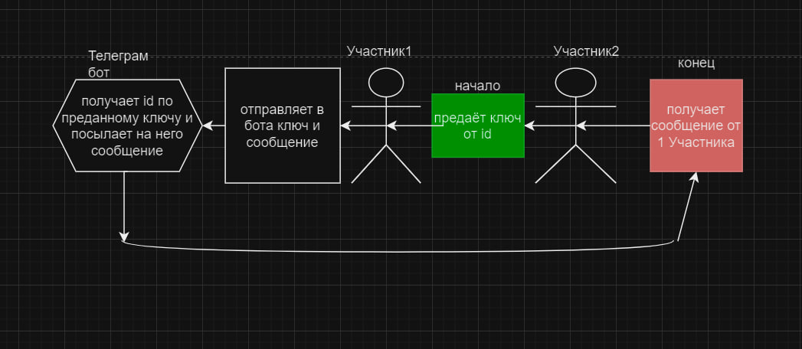

# privacy_telegram_ekosistem

# Тема проекта:
### Приватная экосистема в Телеграм

# Краткое описание:
### Это целая приватная экосистема, в которой свой **мессенджер** и **интернет**, и всё будет сделано с упором на максимальную безопасность и интерфейс, в котором можно работать без единого ввода текста!

# Список команд:
 /start старт   
 /help помощь   
 /start_chat начать перписывать в [Мессенджере](#messenger)  
 /settings настройки    
 /create_id создание ключей для id    
 /internet выход в приватный интренет тг бота   
 /add_site добавить новый сайт   
 /developers для разработчиков (чтобы добавить бота на свой сервер)   
 /change_id позволяет сменить свой id   

# Полное описание:
# messenger
## принцыип работы:
### сначла разберемся с телграмом чтобы отправить сообщение бот должен иметь id человека а если отправляет человк нужно знать его профиль оба варинанта череваты атаками со стороны злоумышленников
### по этому в своём проекте с разработал систему которая генерирует 3 id которые явлюяться ключами для получения реального id человека и отправки ему сообщений человек который имеет ключи не получает с помощью них id телеграмм а лишь сообщает боту по каким ключам нужно найти его для отправки дальше бот отрпавляет сообщение на id тлеграмм пользователя

### Смсл этоо в том что человек отсаеть полность анонимен а благодаря динамичным ключам для id их можно сменить и все котакты получат уведомление об их смене а злоумышленик никогда его не найдут!
## Как начать общение?
### Ответ: также как и в телеграмме но вместо номера телефона ваш ключ от id + я разработал систему когда бот от вашего лица пишет сообщения в группе [как добавить бота в группу?](#grupp_send)

# Интернет
## принцип работы:
### пользователь загружает html css java script файл после чего они выгружаються на мой сайт и любой может их посмотреть из зачего в итоге получаеться интернет
### плюсы в том что людям не нужно иметь свой сервер для хостинга и пользователям ли владельцам сайтов практическии не возможно навредить
### всё из за того что сайт открываеться черзе телграмм так ещё и мой сервер не позволяет иметь свой серверный код что ограничивает функционал сайтов но они польностью безопасны

## загрузка сайтов
### чтобы загрузить сайт нужно выполнить функцию /add_site а дальше следовать укзаниям бота

## плюсы оего интренета
### 1 безопасные платежи 
### 2 полная юезопасность для пользователей и владельцов сайтов
### 3 интрефейс и единая платформа

# grupp_send
## Принцип работы:
### вы пишите в бота в какую группу хоитите отрпавить сообщение и само сообщение а дальше всё тоже самое что и в обычной отправке
### для отрпавки нужно чтобы автор канал иницализировала бота в свою группу
## Иициализация в группе
нужно добавить бота если у вас канал то нужно открыть его парметры нажать администраторы:

### после чего нужно нажать кнопку добавить администратора

### Далее нужно укзать эту ссылку *https://t.me/system_alert_my_bot* 

###   после чего вызвать функцию /developers и выполнить требования бота после чего он добавит ваш канал или группу в базу если бот перестанет быть админом то после первой отправки сообщения сообщит что он больше не админ и удалит вас из базы 
