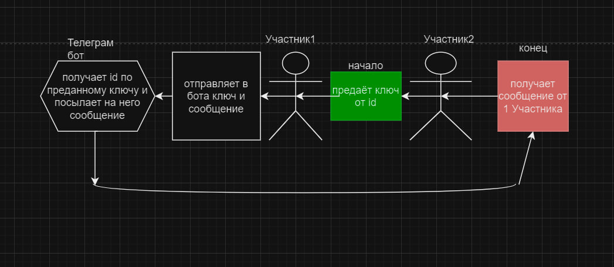

# privacy_telegram_ekosistem

# ССылка на бота *https://t.me/Privacy_telegram_system_bot*

# Тема проекта:
### Приватная экосистема в Телеграм

# Краткое описание:
### Это целая приватная экосистема, в которой свой **мессенджер** и **интернет**, и всё будет сделано с упором на максимальную безопасность и интерфейс, в котором можно работать без единого ввода текста!

# Список команд:
 /start старт   
 /help помощь   
 /start_chat начать перписывать в [Мессенджере](#messenger)  
 /settings настройки    
 /create_id создание [ключей](https://github.com/Sergeiprogrammer/privacy_telegram_ekosistem/edit/main/README.md#%D0%BF%D0%BE-%D1%8D%D1%82%D0%BE%D0%BC%D1%83-%D0%B2-%D1%81%D0%B2%D0%BE%D1%91%D0%BC-%D0%BF%D1%80%D0%BE%D0%B5%D0%BA%D1%82%D0%B5-%D1%81-%D1%80%D0%B0%D0%B7%D1%80%D0%B0%D0%B1%D0%BE%D1%82%D0%B0%D0%BB-%D1%81%D0%B8%D1%81%D1%82%D0%B5%D0%BC%D1%83-%D0%BA%D0%BE%D1%82%D0%BE%D1%80%D0%B0%D1%8F-%D0%B3%D0%B5%D0%BD%D0%B5%D1%80%D0%B8%D1%80%D1%83%D0%B5%D1%82-3-id-%D0%BA%D0%BE%D1%82%D0%BE%D1%80%D1%8B%D0%B5-%D1%8F%D0%B2%D0%BB%D1%8E%D1%8F%D1%82%D1%8C%D1%81%D1%8F-%D0%BA%D0%BB%D1%8E%D1%87%D0%B0%D0%BC%D0%B8-%D0%B4%D0%BB%D1%8F-%D0%BF%D0%BE%D0%BB%D1%83%D1%87%D0%B5%D0%BD%D0%B8%D1%8F-%D1%80%D0%B5%D0%B0%D0%BB%D1%8C%D0%BD%D0%BE%D0%B3%D0%BE-id-%D1%87%D0%B5%D0%BB%D0%BE%D0%B2%D0%B5%D0%BA%D0%B0-%D0%B8-%D0%BE%D1%82%D0%BF%D1%80%D0%B0%D0%B2%D0%BA%D0%B8-%D0%B5%D0%BC%D1%83-%D1%81%D0%BE%D0%BE%D0%B1%D1%89%D0%B5%D0%BD%D0%B8%D0%B9-%D1%87%D0%B5%D0%BB%D0%BE%D0%B2%D0%B5%D0%BA-%D0%BA%D0%BE%D1%82%D0%BE%D1%80%D1%8B%D0%B9-%D0%B8%D0%BC%D0%B5%D0%B5%D1%82-%D0%BA%D0%BB%D1%8E%D1%87%D0%B8-%D0%BD%D0%B5-%D0%BF%D0%BE%D0%BB%D1%83%D1%87%D0%B0%D0%B5%D1%82-%D1%81-%D0%BF%D0%BE%D0%BC%D0%BE%D1%89%D1%8C%D1%8E-%D0%BD%D0%B8%D1%85-id-%D1%82%D0%B5%D0%BB%D0%B5%D0%B3%D1%80%D0%B0%D0%BC%D0%BC-%D0%B0-%D0%BB%D0%B8%D1%88%D1%8C-%D1%81%D0%BE%D0%BE%D0%B1%D1%89%D0%B0%D0%B5%D1%82-%D0%B1%D0%BE%D1%82%D1%83-%D0%BF%D0%BE-%D0%BA%D0%B0%D0%BA%D0%B8%D0%BC-%D0%BA%D0%BB%D1%8E%D1%87%D0%B0%D0%BC-%D0%BD%D1%83%D0%B6%D0%BD%D0%BE-%D0%BD%D0%B0%D0%B9%D1%82%D0%B8-%D0%B5%D0%B3%D0%BE-%D0%B4%D0%BB%D1%8F-%D0%BE%D1%82%D0%BF%D1%80%D0%B0%D0%B2%D0%BA%D0%B8-%D0%B4%D0%B0%D0%BB%D1%8C%D1%88%D0%B5-%D0%B1%D0%BE%D1%82-%D0%BE%D1%82%D1%80%D0%BF%D0%B0%D0%B2%D0%BB%D1%8F%D0%B5%D1%82-%D1%81%D0%BE%D0%BE%D0%B1%D1%89%D0%B5%D0%BD%D0%B8%D0%B5-%D0%BD%D0%B0-id-%D1%82%D0%BB%D0%B5%D0%B3%D1%80%D0%B0%D0%BC%D0%BC-%D0%BF%D0%BE%D0%BB%D1%8C%D0%B7%D0%BE%D0%B2%D0%B0%D1%82%D0%B5%D0%BB%D1%8F) для id    
 /internet выход в приватный [Интернет](#internet) тг бота   
 /add_site добавить [новый сайт](https://github.com/Sergeiprogrammer/privacy_telegram_ekosistem/edit/main/README.md#%D0%B7%D0%B0%D0%B3%D1%80%D1%83%D0%B7%D0%BA%D0%B0-%D1%81%D0%B0%D0%B9%D1%82%D0%BE%D0%B2)   
 /developers для разработчиков ([чтоыб добавить бота на сервер или в группу](https://github.com/Sergeiprogrammer/privacy_telegram_ekosistem/edit/main/README.md#%D0%B8%D0%B8%D1%86%D0%B8%D0%B0%D0%BB%D0%B8%D0%B7%D0%B0%D1%86%D0%B8%D1%8F-%D0%B2-%D0%B3%D1%80%D1%83%D0%BF%D0%BF%D0%B5))   
 /change_id позволяет сменить свой id   

# Полное описание:
# messenger
## принцыип работы:
### сначла разберемся с телграмом чтобы отправить сообщение бот должен иметь id человека а если отправляет человк нужно знать его профиль оба варинанта череваты атаками со стороны злоумышленников
### по этому в своём проекте с разработал систему которая генерирует 3 id которые явлюяться ключами для получения реального id человека и отправки ему сообщений человек который имеет ключи не получает с помощью них id телеграмм а лишь сообщает боту по каким ключам нужно найти его для отправки дальше бот отрпавляет сообщение на id тлеграмм пользователя

### Смсл этоо в том что человек отсаеть полность анонимен а благодаря динамичным ключам для id их можно сменить и все котакты получат уведомление об их смене а злоумышленик никогда его не найдут!
## Как начать общение?
### Ответ: также как и в телеграмме но вместо номера телефона ваш ключ от id + я разработал систему когда бот от вашего лица пишет сообщения в группе [как добавить бота в группу?](https://github.com/Sergeiprogrammer/privacy_telegram_ekosistem/edit/main/README.md#%D0%B8%D0%B8%D1%86%D0%B8%D0%B0%D0%BB%D0%B8%D0%B7%D0%B0%D1%86%D0%B8%D1%8F-%D0%B2-%D0%B3%D1%80%D1%83%D0%BF%D0%BF%D0%B5))
### ДОПОЛНЕНИЕ для удобства интрефейса в моём боте есть ники людей но они могут повторяться и это сделана спецально чтобы зная ник который легче запомнить чем id было тяжелее следить за человекаом

# internet
## принцип работы:
### пользователь загружает html css java script файл после чего они выгружаються на мой сайт и любой может их посмотреть из зачего в итоге получаеться интернет
### плюсы в том что людям не нужно иметь свой сервер для хостинга и пользователям ли владельцам сайтов практическии не возможно навредить
### всё из за того что сайт открываеться черзе телграмм так ещё и мой сервер не позволяет иметь свой серверный код что ограничивает функционал сайтов но они польностью безопасны

# Site
## на сайте есть 3 оснвных части главная страница форум и бан лист на 
## Осноавная страница 
### на ней есть вес сайты представленный моим инетрнетом
## Банлист 
### туда в открытй доступ выкладываеться информацию о забаненых чтобы те могли понять почему их забанили и опорить это

# загрузка сайтов
### чтобы загрузить сайт нужно выполнить функцию /add_site а дальше следовать укзаниям бота
### сайты с помошью уникальной системы проверяються на вирусы а после сами подгружаються в систему и полность функционируют остаёться только презагрузить страницу

## плюсы моего интренета
### 1 безопасные платежи 
### 2 полная юезопасность для пользователей и владельцов сайтов
### 3 интрефейс и единая платформа

# Структура базы данных
## ban_list
### users
#### сюда поподают забаненый а потом их выгрюжает на сайт с банаи и они больше не могут пользоваться ботом
## bot_id.db
### users
####
### settigns1
####
### settings2
####
### alloewd servers
####

# Отправка в группу
## Принцип работы:
### вы пишите в бота в какую группу хоитите отрпавить сообщение и само сообщение а дальше всё тоже самое что и в обычной отправке
### для отрпавки нужно чтобы автор канал иницализировала бота в свою группу
## Иициализация в группе
нужно добавить бота если у вас канал то нужно открыть его парметры нажать администраторы:

### после чего нужно нажать кнопку добавить администратора

### Далее нужно укзать эту ссылку *https://t.me/Privacy_telegram_system_bot* 

# ВАЖНО ЗАОПМНИТЕ ID КОТОРЫЙ ОН ВАМ ВЫДАЛ ИНАЧЕ ВАМ ПРЕДЕТЬСЯ ПОТОРВИТЬ ПРОШЛЫЙ ЭТАП
###   после чего вызвать функцию /developers и выполнить требования бота после чего он добавит ваш канал или группу в базу если бот перестанет быть админом то после первой отправки сообщения сообщит что он больше не админ и удалит вас из базы 

# как начать работать с ботом
## api keys
### для начала укажите всой api key в фалйе telgramm.py по пути messenger/telegramm/telegramm.py и укажите там свой тоекн дальше тоже самое сделайте в файл virus_check (если вам нужно добавление сайтов и проверка на вируы) а также рекмондею в папке site в каталоге messangere посмотреть не знаят ли у вас проброшенный порт другим процессом иначе сайт будет не рабочим
### чтобы начать непосредвенно работу проверть наличие этих библиотек:
### telebot
### sqlite3
### secrets
### telegram 
### zipfile
### os
### shutil
### re
### requests
### дальше запустите файлы messenger/site/main.py и messenger/telegramm/telegramm.py перейдите на центральную страницу на сайте которыйй высветился вам в консоли из файла main и после того как увдиели интрейес может сворачивать и запускать тг бота иначе функцию internet не будет работать так как центральный путь сайт будет не прогружен и не обозначен системой
